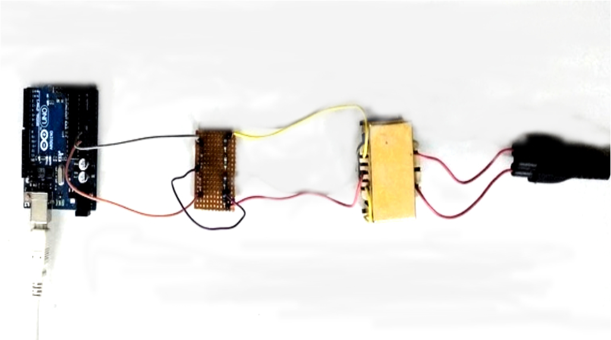

# SPCUP 2016 Hardware
Make sure that you are in correct branch before moving forward

This repo main aim recreate the setup for collecting ENF data
# Setup
1) Assemble your hardware as shown in image 

2) Upload "arduino/arduino.ino" into arduino

3) Set "time_req" variable in "python_program.py"

4) After setting up run the file "python_program.py"

5) Then run "textFile_to_audioFile.m" to get the corresponding ".wav" files

# Points to remember
	Right end to plug point
	Other end to laptop or any arduino data collecting device
	Circuit is to convert 9 Volt supply to 5 Volt supply
	Arduino Uno(or higher) or should be able to send serially at 1khz or higher
	
# Example ".wav" files
You can find example ".wav" files in "Our Recordings" folder
  ## Recording times:-
		IITH_1 - 28 December 2015 11:01 am to 28 December 2015 11:41 am
		IITH_2 - 29 December 2015 9:04 am to 29 December 2015 9:45 am
		IITH_3 - 30 December 2015 5:57 am to 30 December 2015 6:42 am
		IITH_4 - 30 December 2015 6:44 am to 30 December 2015 7:24 am
		IITH_5 - 31 December 2015 7:49 pm to 31 December 2015 8:52 pm
		IITH_6 - 31 December 2015 10:22 pm to 31 December 2015 11:23 pm
		IITH_7 - 1 January 2016 4:59 pm to 1 January 2016 6:00 pm
		IITH_8 - 2 January 2016 2:57 pm to 2 January 2016 3:57 pm
		IITH_9 - 9 January 2016 11:27 am to 9 January 2016 12:29 pm
		IITH_10 - 10 January 2016 10:25 am to 10 January 2016 11:28 am
		IITH_11 - 10 January 2016 2:56 pm to 10 January 2016 3:57 pm
		IITH_12 - 15 January 2016 10:53 pm to 15 January 2016 11:21 pm
